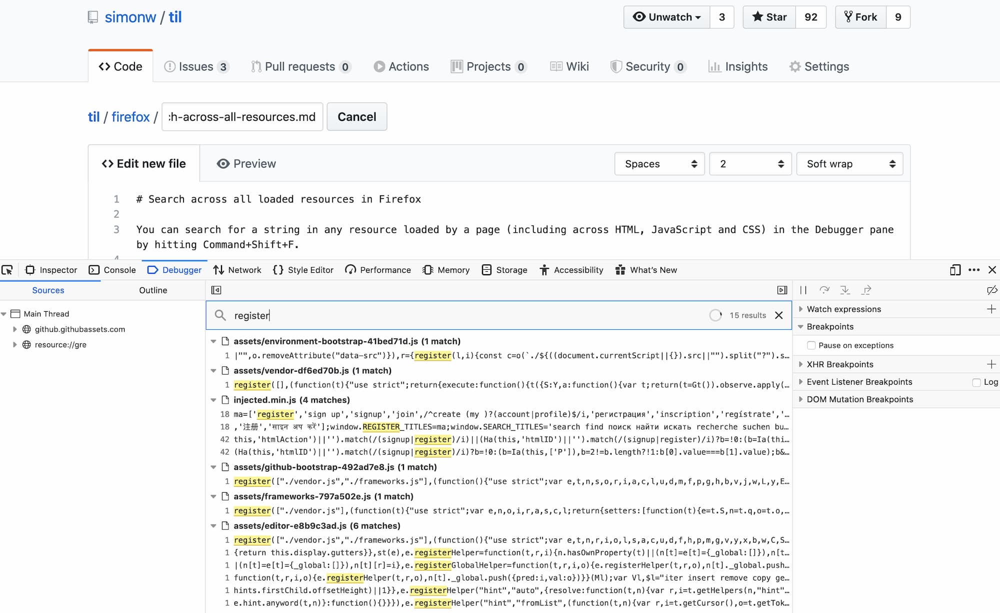

# Search across all loaded resources in Firefox

You can search for a string in any resource loaded by a page (including across HTML, JavaScript and CSS) in the Debugger pane by hitting Command+Shift+F.

This doesn't appear to search the body of any JSON assets that were fetched by code. Presumably this is because JSON isn't automatically loaded into memory by the browser - your own JavaScript code is expected to parse it and then free up the resources that were used to load it.
