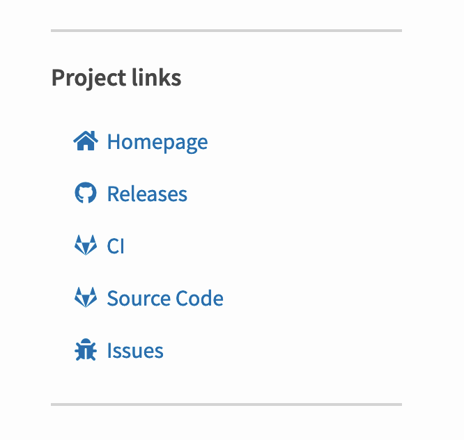

# Adding project links to PyPI

I spotted a neat looking project links section on https://pypi.org/project/ExifReader/

Turns out that's added using a `project_urls` key in setup.py, e.g. here: https://gitlab.com/Cyb3r-Jak3/exifreader/-/blob/publish/setup.py

```python
    project_urls={
        "Issues": "https://gitlab.com/Cyb3r-Jak3/ExifReader/issues",
        "Source Code": "https://gitlab.com/Cyb3r-Jak3/ExifReader/-/tree/publish",
        "CI": "https://gitlab.com/Cyb3r-Jak3/ExifReader/pipelines",
        "Releases": "https://github.com/Cyb3r-Jak3/ExifReader"
    },
```
The [documentation](https://packaging.python.org/guides/distributing-packages-using-setuptools/#project-urls) says that the keys can be any string you like. So where do those icons come from?

I looked at the HTML source code and searched the PyPI website source code for one of the CSS classes I found there: https://github.com/pypa/warehouse/search?q=fa-bug&unscoped_q=fa-bug

This lead me to the macro that defines the custom icons, which shows what custom keys or URLs are supported: https://github.com/pypa/warehouse/blob/2f00f4a9f208546ff0ebb6a6e61439021ca60a43/warehouse/templates/packaging/detail.html#L16-L60

I added these to the [sqlite-utils PyPI page](https://pypi.org/project/sqlite-utils/) in [this commit](https://github.com/simonw/sqlite-utils/commit/74b30af31bf5169559c06aa6e57e1e4873076720).


